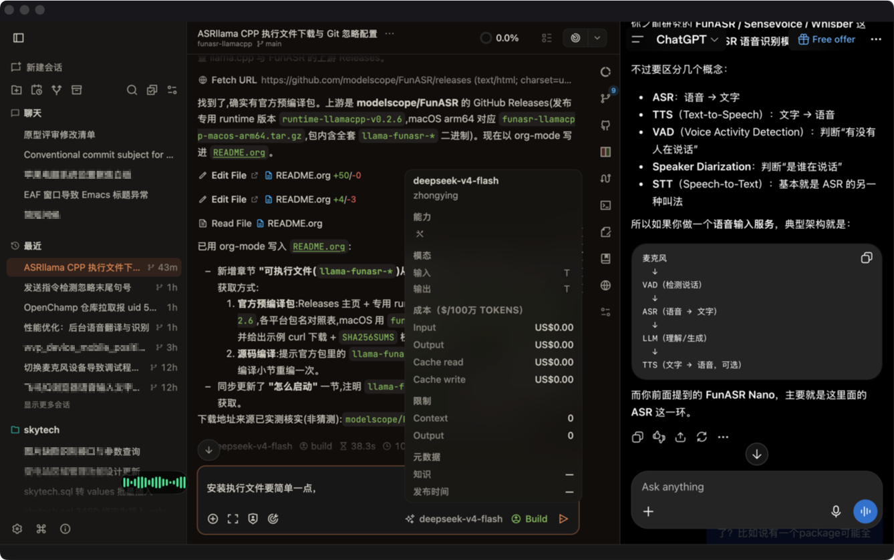

#+TITLE: 本地语音转文字 LocalAudioSTT
#+subtitle: CPU-only、无 Python 运行时、OpenAI 兼容接口的本地 ASR 服务
#+author: van
#+date: <2026-09-01 16:40>
#+SETUPFILE: ~/.doom.d/org-classic-head.setup

* outline
** WHY

https://github.com/sincebyte/LocalAudioSTT 是一个本地的语音转文字（ASR）服务。它把 FunASR(https://github.com/modelscope/FunASR) 的 GGUF 模型跑在 llama.cpp 上，暴露一个 OpenAI 兼容的接口 `POST /v1/audio/transcriptions`。 也就是把本地录音文件转成文字。

结合FunASR的特点：

- **不需要 GPU** ：纯 CPU 推理，Mac 笔记本、Linux 小盒子都能跑
- **不需要 Python 运行时** ：推理全部在 C++ 二进制里完成，只有一个很薄的 HTTP 包装层
- **数据不出本机** ：录音文件全部在本地处理，不上传任何服务器
- **OpenAI 兼容接口** ：OpenChamber、以及任何支持 OpenAI 语音接口的工具， 填个 URL 就能直接用
- **常驻模式** 本项目优化补丁，模型只加载一次，处理音频更快
  

** 下载模型

本仓库默认跑的是  **Fun-ASR-Nano** （编码器 + Qwen3-0.6B 大语言模型 + FSMN-VAD 前端），模型都已经转换成 GGUF 格式，直接从 HuggingFace 下载 即可，不需要 Python 的深度学习环境。

| 文件                      | 说明                                | 下载地址（HuggingFace）                              |
|---------------------------+-------------------------------------+------------------------------------------------------|
| =funasr-encoder-f16.gguf= | SAN-M 音频编码器                    | https://huggingface.co/FunAudioLLM/Fun-ASR-Nano-GGUF |
| =qwen3-0.6b-q5km.gguf=    | Qwen3-0.6B 语言模型（5-bit 量化）   | 同上，同一仓库                                       |
| =fsmn-vad.gguf=           | 语音活动检测（VAD，用于长音频切分） | https://huggingface.co/FunAudioLLM/fsmn-vad-GGUF     |

直接访问上面的 HuggingFace 仓库地址，把对应文件下载到 =gguf/= 目录即可。

** 编译 

=llama-funasr-cli= 需要 **--server 常驻模式** 才能让服务只加载一次模型、常驻 内存处理请求。 **官方预编译的二进制不带这个参数** ，所以本方案不下载官方
二进制，而是 **直接从源码编译** （编译脚本会自动打好下面的加速补丁）。 编译产物不随本仓库 git 分发（已在 .gitignore 排除），换机器后重新编译一次即可。

*需要安装的前置软件*

编译前先确认下面几个软件已经装好：

| 前置软件                   | 作用                                      | macOS 安装方式                                 |
|----------------------------+-------------------------------------------+------------------------------------------------|
| git                        | 拉取 FunASR 源码                          | 随 Xcode 命令行工具自带；或 =brew install git= |
| cmake                      | 配置并编译（会自动拉取 llama.cpp 并构建） | =brew install cmake=                           |
| C/C++ 工具链（clang/make） | 编译 C++ 源码                             | =xcode-select --install=                       |

装完后验证都能用：

#+BEGIN_SRC bash
git --version
cmake --version
clang --version
#+END_SRC

*补丁是做什么的*

官方 CLI 是"一次性"版本：转完一个音频就退出，每个请求都要重新加载约 1GB 的模型。
本仓库默认的 **常驻模式** （`start-funasr-server.sh` 拉起一个 `llama-funasr-cli --server` worker，模型只加载一次，处理音频更快）需要 =--server= 参数，官方二进制不带它，所以仓库放了补丁：

| 文件                                         | 作用                                                          |
|----------------------------------------------+---------------------------------------------------------------|
| =patches/llama-funasr-cli.server-mode.patch= | 给官方 CLI 源码新增 =--server= 常驻模式参数（可重复打，幂等） |

*怎么编译并打好补丁*

用仓库自带的一键脚本（自动完成：拉源码 → 打补丁 → 编译 →  得到 =llama-funasr-cli= ）：

#+BEGIN_SRC bash
./build-funasr-cli-server.sh --install
#+END_SRC

验证补丁是否打上（编译成功的二进制在 --help 里应能看到 --server）：

#+BEGIN_SRC bash
./llama-funasr-cli --help 2>&1 | grep -- --server
#+END_SRC

*llm 档整理模型（仅 =FUNASR_ORGANIZER=llm= 或手动整理接口需要）

=llm= 档整理需要一个 **通用 chat 模型**：Fun-ASR 调优版的
Qwen3（=qwen3-0.6b-q8_0.gguf=/q5km，用于语音转写）遇到纯文本请求会直接结束，无法做排版。
所以整理用的是同一个 llama.cpp 的 **=llama-server=** 进程，默认加载
=gguf/qwen3-0.6b-chat-q8_0.gguf= （通用 Qwen3 聊天版量化为 Q8_0，速度快；实测数百字整理约 2~4 秒）。

*准备通用聊天模型（一次即可）*

从 Qwen 官方 HF 仓库下载 =Qwen3-0.6B= 的 BF16 GGUF 放到 =gguf/Qwen3-0.6B-BF16.gguf=，
再用编译出的 =llama-quantize= 量化一份快的 Q8_0 版本（默认优先用它）：

#+BEGIN_SRC bash
cmake --build .build/build-llama-server -j --target llama-quantize
.build/build-llama-server/bin/llama-quantize \
  gguf/Qwen3-0.6B-BF16.gguf gguf/qwen3-0.6b-chat-q8_0.gguf Q8_0
#+END_SRC

没有 Q8 版时 =start-funasr-server.sh= 会自动回退到 BF16（更慢）；也可用
=FUNASR_REFORMAT_GGUF= 指定别的文件。

*编译 llama-server（仅 llm 档需要）*

=llama-server= 不是 FunASR 分支编译的，直接从上面编译时拉取的 llama.cpp 源码单独编一个：

#+BEGIN_SRC bash
cmake -S .build/build-runtime/_deps/llama-src -B .build/build-llama-server \
  -DCMAKE_BUILD_TYPE=Release -DLLAMA_BUILD_SERVER=ON \
  -DLLAMA_BUILD_EXAMPLES=ON -DLLAMA_BUILD_COMMON=ON -DLLAMA_BUILD_TOOLS=ON \
  -DLLAMA_BUILD_HTML=OFF -DLLAMA_BUILD_UI=OFF -DLLAMA_CURL=OFF
cmake --build .build/build-llama-server -j --target llama-server
cp .build/build-llama-server/bin/llama-server ./llama-server
#+END_SRC

不需要网页 UI 也可关闭：若链接报缺 UI 资产，把上面 `-DLLAMA_BUILD_UI=OFF` 换成 `-DLLAMA_USE_PREBUILT_UI=ON` 重配再编。
产物 =llama-server= 不随 git 分发（已在 .gitignore 排除）。

** 启动

确保以下文件存在：

- =llama-funasr-cli= ← 由上一步编译生成（不随 git 分发）
- =gguf/qwen3-0.6b-q5km.gguf=
- =gguf/funasr-encoder-f16.gguf=
- =gguf/fsmn-vad.gguf=
- =llama-server= ← 仅 llm 档/手动整理需要，按上节编译（默认 rule 档不拉取）
- =gguf/qwen3-0.6b-chat-q8_0.gguf= ← 通用 Qwen3 聊天模型（llm 档用；缺则自动回退 BF16）

缺执行文件的话，先按上节「编译 llama-funasr-cli」编译；缺模型的话，直接按 上文地址从 HuggingFace 下载到 =gguf/= 目录。

一键启动（默认端口 8001，会先杀掉占用 8001 的旧进程再启动）。脚本把服务 放到 **后台** 运行，打印一段日志后立即退出，并报告 **启动成功/失败** ：

#+BEGIN_SRC bash
./start-funasr-server.sh
#+END_SRC

- 启动成功 → 输出 =启动成功 ✓  http://127.0.0.1:8001 (PID xxx)= ，脚本退出码 0
- 启动失败 → 输出 =启动失败 ✗= 并附日志尾部，脚本退出码 1
- 服务日志写在 =funasr-server/server.log=

验证是否启动成功：

#+BEGIN_SRC bash
curl http://127.0.0.1:8001/health          # 期望: {"status": "ok"}
#+END_SRC

也可以直接命令行测试转写：

#+BEGIN_SRC bash
curl http://127.0.0.1:8001/v1/audio/transcriptions \
  -F file=@/tmp/xxx.wav -F model=funasr-gguf
#+END_SRC

如需改端口/模型，用环境变量，例如 =FUNASR_PORT=9000 ./start-funasr-server.sh=

停止服务：

#+BEGIN_SRC bash
kill <脚本输出的 PID>
#+END_SRC

** 自动排版（转写接口直接返回整理结果）

=POST /v1/audio/transcriptions= **一步到位**：语音转成文字后，按整理档位
（=FUNASR_ORGANIZER=）处理并直接返回；末尾补一个空行，让连续两段语音插入输入框时呈现
明显段落隔断。默认 **=rule= 档**：

- =none=：只返回原始转写（做 /sil 清理与段间换行），不整理。
- =rule=：本地确定性整理，**不调用任何大模型**——把行首干净的枚举词（第X点/一、等）
  归一为编号行（`1. …`）。转写只用语音模型一次推理，也不拉起 llama-server。
- =llm=：智能校对整理——按语义修正口误（说错又纠正时只保留最后正确说法）、删除"嗯/啊/呃/那个/就是/然后"等口头语、不强行编号、整理成通顺书面文本；保持原语言不翻译，若模型把中文"改写"成英文（幻觉）会自动回退原文；由通用 chat 模型完成。质量最高，但需要 llama-server 与通用模型（=FUNASR_ORGANIZER=llm ./start-funasr-server.sh=）。

语音模型（Fun-ASR 调优版）无法处理纯文本，所以 =llm= 档与手动整理接口需要
=start-funasr-server.sh= 拉起的 =llama-server= （加载通用 Qwen3-0.6B chat，Q8_0 默认），
接口内部自动转发到它的 /v1/chat/completions；仅 =llm= 档或 =FUNASR_REFORMAT=1= 时才拉起该进程。
=rule=/=none= 档不依赖它；整理后端缺失或失败都会自动退回原文，不影响转写本身。

=POST /v1/text/reformat= 仍保留，供把**一大段累积文本**手动整理（需 llama-server 在线，
即 llm 档或 =FUNASR_REFORMAT=1= 启动）：

#+BEGIN_SRC bash
curl http://127.0.0.1:8001/v1/text/reformat \
  -H 'Content-Type: application/json' \
  -d '{"text": "我说一下第一点要买牛奶第二点要交水电费另外还有一件事明天下午三点开会"}'
#+END_SRC

响应： ={"text": "整理后的文本"}= （调用方用返回结果**整体替换**输入框内容）。

- 识别提示词（语音转文字阶段）缺省模板覆盖：语言范围（只中英、中文为主）、英文单词按原文输出、
  自动加中文标点、结合上下文纠正同音错别字；数字一律用阿拉伯数字；识别偏置含指令词 =clear= 与 =发送=；
  不做序号相关要求；
  可 =FUNASR_PROMPT='你的提示词' ./start-funasr-server.sh= 整体替换。
- llm 档自定义排版指令：=FUNASR_REFORMAT_PROMPT='你的排版要求'=；单次整理请求可在 JSON 里带 =prompt= 覆盖。
  缺省排版指令只做逐句校对排版，并把所有中文数字不分场景改写为阿拉伯数字。
- 排版模型/端口可改：=FUNASR_REFORMAT_GGUF=、=FUNASR_REFORMAT_PORT=、=FUNASR_REFORMAT_MODEL=。
- =llm= 档若模型输出 =<think>= 块会被剥除（=strip_thinking=），数百字整理约 1~3 秒。
- 数字规范化（ITN-lite，全档位自动）：转写输出经 =cn2an= 把中文数字确定性转阿拉伯数字
  （数量/日期/金额/百分数及区间/序数/小数等），星期与固定成语不受影响；
  需运行解释器已装 =pip install cn2an=，未装则原样输出、不影响其它功能。rule 档默认即生效，无需第二段大模型。
- 指令词后校准（全档位自动，确定性）：把接近 =clear= 与 =发送= 的误识
  （英文形变 =claer/clea= 及中文谐音 =可丽儿/克丽尔/发松/发宋…=）统一归一为标准词；
  可用 =FUNASR_COMMAND_ALIASES='{"clear": ["克丽尔"], "发送": ["法宋"]}'= 追加你实测的错词。
- 局限：=rule= 档无法拆"无标点连读"的枚举列表，也不会删口头语/改口误（只有 llm 档会）；
  =llm= 档 0.6B 属"尽力而为"，复杂长句的语义修正偶有不到位。要更稳可换更大的 chat GGUF。

** 在 OpenChamber 里使用

1. 先按上面步骤启动服务。
2. 打开 OpenChamber → 设置（Settings）→ 语音（Voice）→ 语音输入。
3. 提供者（Provider）选择 **服务器 / Server** （即 OpenAI 兼容）。
4. 填写以下三项：

| 字段          | 值                              |
|---------------+---------------------------------|
| 服务器 URL    | =http://127.0.0.1:8001/v1=      |
| 模型（Model） | #ERROR                          |
| API Key       | 留空或随便填，如 =not-required= |
#+TBLFM: $2=funasr-gguf= （任意字符串，服务端不校验）

5. 语言（Language）留空即可（自动检测），或填 =zh= / =en=
6. 保存后，对着输入框说话，文字就会插入到对话里。

说明：OpenChamber 会把录音转成 WAV 并 POST 到
=服务器 URL + /audio/transcriptions= ，所以填 =http://127.0.0.1:8001/v1= （ =127.0.0.1= 是允许的本地地址）。

** 在 debuff 里使用

debuff 要求填 **完整的转写接口地址** （不能只填到 =/v1= ）。此时把下面 这个地址直接填成 URL：

- URL / 接口地址： =http://127.0.0.1:8001/v1/audio/transcriptions=
- 模型（Model）： =funasr-gguf= （任意字符串，服务端不校验）
- API Key：留空或随便填，如 =not-required=

** 性能测试

测试机器：MacBook Pro 14 英寸，Apple M1 Pro（8 性能核 + 2 能效核）， 16GB 内存，macOS 26.6.2。

| 项目                                        | 数值                                               |
|---------------------------------------------+----------------------------------------------------|
| 服务常驻内存（Python 包装进程，空闲）       | 约 13~23 MB                                        |
| 单次转写时推理进程峰值内存                  | 约 1.56 GB                                         |
| 模型磁盘占用                                | 编码器 469 MB + Qwen3 551 MB + VAD 1.7 MB ≈ 1.0 GB |
| 是否需要 GPU                                | 不需要                                             |
| 转写速度（10 秒音频，常驻模式，模型已加载） | 约 0.5 秒                                          |
| 转写速度（20 秒音频，常驻模式，模型已加载） | 约 1.0 秒                                          |
| 转写速度（50 秒音频，常驻模式，模型已加载） | 约 3.5 秒                                          |

服务默认以 **常驻模式** 运行：启动时加载一次模型（约 1~1.5 秒），之后每个请求 直接复用内存里的模型，不再重新加载。实测耗时：

| 音频时长 | 常驻模式 | 每请求拉起子进程（旧模式） |
|----------+----------+----------------------------|
| 10 秒    | ~0.5 秒  | ~1.4~2.5 秒                |
| 20 秒    | ~1.0 秒  | ~1.8~2.5 秒                |
| 30 秒    | ~1.5 秒  | ~2.5~2.9 秒                |
| 40 秒    | ~3.1 秒  | ~4.0~4.4 秒                |
| 50 秒    | ~3.5 秒  | ~4.5~5.0 秒                |

